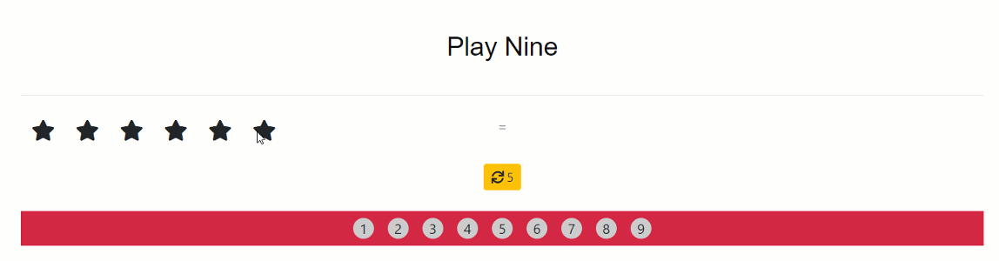

# PLAY NINE 
---
### React JS ⚛️ + Training 🎳 = Awesome Game 🎯   --->   🚀

## What technologies that i used ?
 - Node JS ( Run-Time Environment ) 10.15.0
 - React JS 16.8.4

## Setup prerequists
 - you have to install NodeJS as it's the service and also to use its package manager npm.

## How to run the application
 - Clone or download files in some place.
 - Open CMD or Terminal in the root folder you just cloned.
 - Write this command ``` npm i ``` to install all dependencies.
 - Then write this command ``` npm run start ``` to run the app.
 - Open the app in the browser wih port ``` 3000 ```. 

## Note : 
---
### There are some bad methods like importation of UI Libraries because it's an old project. ( This project was during the beginning of `REACT JS` learning ).. 

## Demo 

  
#### License
---
[MIT](https://choosealicense.com/licenses/mit/)  
